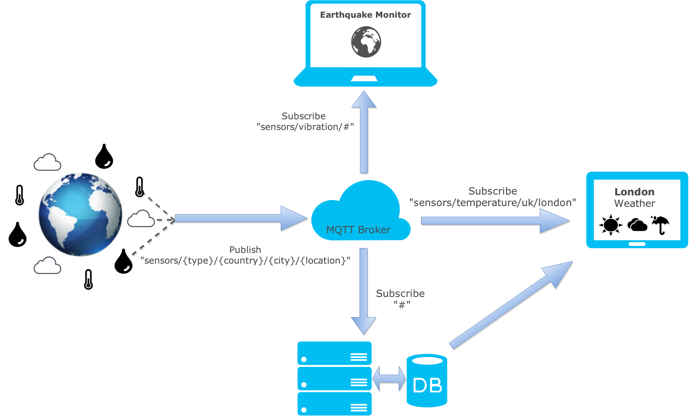

class: split-30 nopadding
background-image: url( https://cloud.githubusercontent.com/assets/4231611/11023041/6ba38b70-86a0-11e5-8b22-8d3dab6cd4c8.jpg )

.column_t2.center[.vmiddle[
.fgtransparent[
.figplaint[

]
]
]]
.column_t2[.vmiddle.nopadding[
.shadelightdark[.boxtitle1[
### LTKA Labs
# Arduino Basics

### [Eueung Mulyana](https://github.com/eueung)
### http://eueung.github.io/ET3010/arduino
#### ET-3010 | [Attribution-ShareAlike CC BY-SA](https://creativecommons.org/licenses/by-sa/4.0/)
#### 
]]
]]

---
class: column_t1 middle

.fonth4[
.tab1.fullwidth[
| Outline  |
|:-------------:|
| Short Intro |
| Quick Start |
| Networking |
| MQTT |
]]

---
class: split-30 nopadding
background-image: url( https://cloud.githubusercontent.com/assets/4231611/11023041/6ba38b70-86a0-11e5-8b22-8d3dab6cd4c8.jpg )

.column_t2.center[.vmiddle[
.fgtransparent[
.figplaint[

]
]
]]
.column_t2[.vmiddle.nopadding[
.shadelightdark[.boxtitle1[
### 
# Short Intro

### 
### 
#### 
#### 
]]
]]

---
class: split-50 nopadding 

.column_t1[.vmiddle.right[


# Arduino

An open-source hardware and software platform for building electronics projects.

.figplaint[

]


]]
.column_t2[.vmiddle[

- Arduino is an .red[open-source electronics] platform based on easy-to-use **hardware** and **software**. It's intended for anyone making interactive projects.
- Arduino .blue[senses] the environment by receiving inputs from many **sensors**, and .blue[affects] its surroundings by controlling lights, motors, and other **actuators**.

- You can tell your Arduino what to do by .uline[writing code] in the Arduino programming language and using the Arduino development environment.
- Several Arduino-Board variants exist e.g.: .red[UNO], NANO, MEGA, DUE, YUN, etc.


]]

---
class: column_t1 center middle

# 
####&nbsp;

.figstyle1[

]


---
class: column_t1 center middle

# 
####&nbsp;

.figstyle1[

]


---
background-image: url(images/fig02.jpg)

---
class: split-30 nopadding
background-image: url( https://cloud.githubusercontent.com/assets/4231611/11023041/6ba38b70-86a0-11e5-8b22-8d3dab6cd4c8.jpg )

.column_t2.center[.vmiddle[
.fgtransparent[
.figplaint[

]
]
]]
.column_t2[.vmiddle.nopadding[
.shadelightdark[.boxtitle1[
### 
# Quick Start

### 
### 
#### 
#### 
]]
]]

---
class: column_t1

.overlay.pos-bl-1[
<svg class="size512 shadowwhite" viewBox="0 0 1024 1024">
  <use xlink:href="images/minions.svg#minion1"></use>
</svg>
]

.overlay.pos-tr-1[.overlayc.top_60.size_300_200.xkcd_font.center.black[

This Checklist Please: <br/><br/> .red[UNO Board Compatible + Acessories]<br/> Components + Wires<br/> <br/> .blue[ARDUINO **IDE**]

]
<svg class="size800 fillwhite" viewBox="0 0 1024 1024">
  <use xlink:href="images/bubbles.svg#bubble1"></use>
</svg>
]

---
background-image: url(images/fig03.jpg)

---
class: column_t1 center middle

# 
####&nbsp;

.figstyle1[

]


---
class: column_t1 center middle

# 
####&nbsp;

.figstyle1[

]
Tools - .bluelight[**Config**]

---
class: column_t1 center middle

# 
####&nbsp;

.figstyle1[

]
.bluelight[**Sketch**] Upload

---
background-image: url(images/fig07.jpg)

---
background-image: url(images/fig08.jpg)

---
class: center middle

# Project #1
####&nbsp;

.figplaint[

]
Fritzing **Breadboard**

---
class: center middle

# Project #1
####&nbsp;

.figplaint[

]
Fritzing **Schematic**

---
class: split-50 nopadding 

.column_t1[.vmiddle[

# Project #1 .bluelight[**Sketch**]

```c
int inPin   = 2; 
int outPin  = 3; 
int potPin  = A0; 

int state = LOW;     
int reading;          
int previous = LOW;   

long time = 0;        
long debounce = 1000;  

int potVal = 0;  
int prevPotVal = 0;

*void setup() {
  Serial.begin(9600);
  delay(500);
  
* pinMode(inPin, INPUT);    
* pinMode(outPin, OUTPUT);  
  Serial.println("Program started ...");
*}
```


]]
.column_t2[.vmiddle[


```c
*void loop() {
* reading = digitalRead(inPin);  

* if (reading && (millis() - time > debounce)) {
    if (previous == LOW) {
      Serial.println("[PHYSICAL] LED turned on"); state = HIGH;
    } else {
      Serial.println("[PHYSICAL] LED turned off"); state = LOW;
    }

    time = millis();
    digitalWrite(outPin, state);
    previous = state;
    prevPotVal = potVal - 10;
* }
* potVal = analogRead(potPin);
* if((state == HIGH) && (abs(potVal-prevPotVal)>4)){
    analogWrite(outPin, potVal/4);  
    Serial.print("[PHYSICAL] LED intensity ");
    Serial.println(potVal/4);
    prevPotVal = potVal;
* }
*}
```


]]

---
background-image: url(images/fig09.jpg)

---
class: column_t1 center middle

# 
####&nbsp;

.figstyle1[

]
Serial **Monitor**

---
class: split-30 nopadding
background-image: url( https://cloud.githubusercontent.com/assets/4231611/11023041/6ba38b70-86a0-11e5-8b22-8d3dab6cd4c8.jpg )

.column_t2.center[.vmiddle[
.fgtransparent[
.figplaint[

]
]
]]
.column_t2[.vmiddle.nopadding[
.shadelightdark[.boxtitle1[
### 
# Networking

### 
### 
#### 
#### 
]]
]]

---
class: center middle

# UNO + Ethernet Shield
####&nbsp;

.figplaint[

]


---
background-image: url(images/fig11.jpg)

---
class: split-50 nopadding 

.column_t1[.vmiddle[

# Example #1 .bluelight[**Web Server**]

```c
*#include <SPI.h>
*#include <Ethernet.h>

*byte mac[] = {
* 0xDE, 0xAD, 0xBE, 0xEF, 0xFE, 0xED
*};
*IPAddress ip(192, 168, 0, 177);

*EthernetServer server(80);

void setup() {
  Serial.begin(9600);
  while (!Serial) {}

* Ethernet.begin(mac, ip);
* server.begin();
  Serial.print("Server is at ");
  Serial.println(Ethernet.localIP());
}

*void loop() {
  // ...
}
```


]]
.column_t2[.vmiddle[


```c
  EthernetClient client = server.available();
  if (client) {
    Serial.println("new client");
    boolean currentLineIsBlank = true;
    
*   while (client.connected()) {
*     if (client.available()) {
        char c = client.read();
        Serial.write(c);
*       if (c == '\n' && currentLineIsBlank) {
          client.println("HTTP/1.1 200 OK"); client.println("Content-Type: text/html"); client.println("Connection: close");  
          client.println("Refresh: 5");  client.println();

          client.println("<!DOCTYPE HTML>"); client.println("<html>");
          for (int analogChannel = 0; analogChannel < 6; analogChannel++) {
            int sensorReading = analogRead(analogChannel);
            client.print("analog input "); client.print(analogChannel); client.print(" is "); client.print(sensorReading);
            client.println("<br />");
          }
          client.println("</html>");
          break;
*       }
*       if (c == '\n')      { currentLineIsBlank = true; } 
*       else if (c != '\r') { currentLineIsBlank = false; }
*     }
*   } // while

    delay(1);
    client.stop();
    Serial.println("client disconnected");
  }
```


]]

---
background-image: url(images/fig12.jpg)

---
class: split-50 nopadding 

.column_t2[.vmiddle[

# Test

```bash
*$> ping 192.168.0.177

Pinging 192.168.0.177 with 32 bytes of data:
Reply from 192.168.0.177: bytes=32 time=2ms TTL=128
Reply from 192.168.0.177: bytes=32 time=3ms TTL=128
Reply from 192.168.0.177: bytes=32 time=2ms TTL=128
Reply from 192.168.0.177: bytes=32 time=2ms TTL=128

Ping statistics for 192.168.0.177:
    Packets: Sent = 4, Received = 4, Lost = 0 (0% loss),
Approximate round trip times in milli-seconds:
    Minimum = 2ms, Maximum = 3ms, Average = 2ms
```


]]
.column_t1[.vmiddle[


```bash
*Server is at 192.168.0.177
*new client
*GET / HTTP/1.1
*Host: 192.168.0.177
Connection: keep-alive
Cache-Control: max-age=0
Accept: text/html,application/xhtml+xml,application/xml;q=0.9,image/webp,*/*;q=0.8
Upgrade-Insecure-Requests: 1
User-Agent: Mozilla/5.0 (Windows NT 6.1; WOW64) AppleWebKit/537.36 (KHTML, like Gecko) Chrome/48.0.2564.97 Safari/537.36
Referer: http://192.168.0.177/
Accept-Encoding: gzip, deflate, sdch
Accept-Language: en-US,en;q=0.8

*client disconnected
new client
GET /favicon.ico HTTP/1.1
Host: 192.168.0.177
Connection: keep-alive
User-Agent: Mozilla/5.0 (Windows NT 6.1; WOW64) AppleWebKit/537.36 (KHTML, like Gecko) Chrome/48.0.2564.97 Safari/537.36
Accept: */*
Referer: http://192.168.0.177/
Accept-Encoding: gzip, deflate, sdch
Accept-Language: en-US,en;q=0.8

client disconnected
```


]]


---
class: column_t1 center middle

# 
####&nbsp;

.figstyle1[

]
Browser

---
class: column_t1 center middle

# 
####&nbsp;

.figstyle1[

]
Serial **Monitor**

---
class: split-50 nopadding 

.column_t1[.vmiddle[

# Example #2 .bluelight[Web Client]
## Single Request

```c
#include <SPI.h>
#include <Ethernet.h>

byte mac[] = {
  0xDE, 0xAD, 0xBE, 0xEF, 0xFE, 0xED
};
IPAddress ip(192, 168, 0, 177);
char server[] = "www.google.com"; 

*EthernetClient client;

void loop() {
* if (client.available()) {
*   char c = client.read();
*   Serial.print(c);
* }

  if (!client.connected()) {
    Serial.println();
    Serial.println("disconnecting.");
    client.stop();

*   while (true);
  }
}
```


]]
.column_t2[.vmiddle[


```c
void setup() {
  Serial.begin(9600);
  while (!Serial) { }

  if (Ethernet.begin(mac) == 0) {
    Serial.println("Failed to configure Ethernet using DHCP");
    Ethernet.begin(mac, ip);
  }
  delay(1000);
  Serial.println("connecting...");

* if (client.connect(server, 80)) {
    Serial.println("connected");

    client.println("GET /search?q=arduino HTTP/1.1");
    client.println("Host: www.google.com");
    client.println("Connection: close");
    client.println();
* } else { Serial.println("connection failed"); }
}
```


]]

---
class: split-50 nopadding 

.column_t2[.vmiddle[

# Example #3 .blue[Web Client]
## Repeated Requests

```c
#include <SPI.h>
#include <Ethernet.h>

byte mac[] = {
  0xDE, 0xAD, 0xBE, 0xEF, 0xFE, 0xED
};
IPAddress ip(192, 168, 0, 177);
char server[] = "www.arduino.cc";

*EthernetClient client;

unsigned long lastConnectionTime = 0;             
const unsigned long postingInterval = 10L * 1000L; 

void setup() {
  Serial.begin(9600);
  while (!Serial) {}

  delay(1000);
  Ethernet.begin(mac, ip);

  Serial.print("My IP address: ");
  Serial.println(Ethernet.localIP());
}
```


]]
.column_t1[.vmiddle[


```c
void loop() {
  if (client.available()) {
    char c = client.read();
    Serial.write(c);
  }

  if (millis() - lastConnectionTime > postingInterval) {
*   httpRequest();
  }
}

*void httpRequest() {
  client.stop();

* if (client.connect(server, 80)) {
    Serial.println("connecting...");

    client.println("GET /latest.txt HTTP/1.1");
    client.println("Host: www.arduino.cc");
    client.println("User-Agent: arduino-ethernet");
    client.println("Connection: close");
    client.println();

    lastConnectionTime = millis();
* } else { Serial.println("connection failed"); }
*}
```


]]


---
class: split-30 nopadding
background-image: url( https://cloud.githubusercontent.com/assets/4231611/11023041/6ba38b70-86a0-11e5-8b22-8d3dab6cd4c8.jpg )

.column_t2.center[.vmiddle[
.fgtransparent[
.figplaint[

]
]
]]
.column_t2[.vmiddle.nopadding[
.shadelightdark[.boxtitle1[
### 
# MQTT

### 
### 
#### 
#### 
]]
]]

---
class: split-50 nopadding 

.column_t1[.vmiddle[

# IoT Protocols

The IoT needs standard protocols. Two of the most promising for small devices are **MQTT** and **CoAP**.

MQTT gives flexibility in communication patterns and acts purely as a pipe for binary data.

CoAP is designed for interoperability with the web.


]]
.column_t2[.vmiddle[

Both MQTT &amp; CoAP:
- Are open standards
- Are better suited to constrained environments .uline[than] HTTP
- Provide mechanisms for asynchronous communication
- Run on IP
- Have a range of implementations

See: [MQTT and CoAP, IoT Protocols](https://eclipse.org/community/eclipse_newsletter/2014/february/article2.php)


]]

---
class: split-50 nopadding 

.column_t2[.vmiddle[

###Architecture
CoAP packets are much smaller than HTTP TCP flows. Bitfields and mappings from strings to integers are used extensively to save space. Packets are simple to generate and can be parsed in place without consuming extra RAM in constrained devices.

CoAP runs over UDP, not TCP. Clients and servers communicate through connectionless datagrams. Retries and reordering are implemented in the application stack. Removing the need for TCP may allow full IP networking in small microcontrollers. CoAP allows UDP broadcast and multicast to be used for addressing.

CoAP follows a client/server model. Clients make requests to servers, servers send back responses. Clients may GET, PUT, POST and DELETE resources.

CoAP is designed to interoperate with HTTP and the RESTful web at large through simple proxies.

Because CoAP is datagram based, it may be used on top of SMS and other packet based communications protocols.


]]
.column_t1[.vmiddle[

# CoAP

CoAP is the **Co**nstrained **A**pplication **P**rotocol from the CoRE (Constrained Resource Environments) IETF group.

###Architecture
Like HTTP, CoAP is a document transfer protocol. Unlike HTTP, CoAP is designed for the needs of constrained devices.


]]

---
class: split-50 nopadding 

.column_t1[.vmiddle[

# MQTT
MQTT is a publish/subscribe messaging protocol designed for lightweight M2M communications. It was originally developed by IBM and is now an open standard. It was designed in 1999 for use on satellites and as such is very light-weight with low bandwidth requirements making it ideal for M2M or IoT applications.


]]
.column_t2[.vmiddle[

###Architecture
MQTT has a client/server model, where every sensor is a client and connects to a server, known as a broker, over TCP.

MQTT is message oriented. Every message is a discrete chunk of data, opaque to the broker.

Every message is published to an address, known as a topic. Clients may subscribe to multiple topics. Every client subscribed to a topic receives every message published to the topic.


]]

---
class: split-70 nopadding 

.column_t1[.vmiddle[

# MQTT
.figstyle1[

]


]]
.column_t2[.vmiddle[

For example, imagine a simple network with three .ulie[clients] and a central **broker**.

All three clients open TCP connections with the broker. Clients B and C .red[subscribe] to the **topic** temperature .

At a later time, Client A .red[publishes] a value of 22.5 for topic temperature . The broker forwards the message to all subscribed clients.

The .blue[publisher subscriber] model allows MQTT clients to communicate one-to-one, one-to-many and many-to-one.


]]

---
class: split-70 nopadding 

.column_t2[.vmiddle[

# MQTT - Publish / Subscribe
.figplaint[

]

The publish / subscribe (often called .red[**pub-sub**]) pattern lies at the heart of MQTT. It's based around a message broker, with other nodes arranged around the broker in a star topology. This is a very different model to the standard client/server approach, and at first it might seem a little strange, but the .uline[decoupling] it provides is a huge advantage in many situations.


]]
.column_t1[.vmiddle[

Clients can publish or subscribe to particular .uline[topics] which are somewhat like message subjects. They are used by the broker to decide *who will receive a message*. 

Topics in MQTT have a particular syntax. They are arranged in a hierarchy using the slash character (**/**) as a separator, much like the path in a URL. So a temperature sensor in your kitchen might publish to a topic like .bluelight[sensors/temperature/home/kitchen].

See: [Zoetrope](https://zoetrope.io/tech-blog/brief-practical-introduction-mqtt-protocol-and-its-application-iot)


]]

---
class: column_t1 middle center

## That's all for now..
&nbsp;
# Enough talking  
# Let's get our hands dirty!!

---
class: center middle

# Project #2
####&nbsp;

.figplaint-75[

]
Previous Circuit + Ethernet Shield

---
class: column_t1

.overlay.pos-bl-1[
<svg class="size512 shadowwhite" viewBox="0 0 1024 1024">
  <use xlink:href="images/minions.svg#minion1"></use>
</svg>
]

.overlay.pos-tr-1[.overlayc.top_60.size_300_200.xkcd_font.center.black[

Additional SW Checklist: <br/><br/> .red[mosquitto message broker]<br/> MQTTLens Chrome Ext./App<br/> .red[pubsubclient lib @knolleary]

]
<svg class="size800 fillwhite" viewBox="0 0 1024 1024">
  <use xlink:href="images/bubbles.svg#bubble1"></use>
</svg>
]

---
class: split-50 nopadding 

.column_t2[.vmiddle[

.figplaint[

]


]]
.column_t1[.vmiddle[


# Arduino - Sensor Node

Publish data to the topic .bluelight[sensors/led/status] every 2 seconds.

These values are the actual device state with considering local input to the sensors (potentio and push button)

The data consist of a .bluelight[status] (either "ON" or "OFF") and of an .bluelight[intensity] (any integer ranging 0 - 254) in the following JSON format:

```json
{
	"data": {
		"status": "ON",
		"intensity": 200
	}
}
```


]]

---
class: split-50 nopadding 

.column_t1[.vmiddle[

# MQTTLens - Client Node

Subscribe to the topic .bluelight[sensors/led/status].


]]
.column_t2[.vmiddle[

# <i class="fa fa-user-secret fa-5x"></i>


]]

---
class: split-30 nopadding
background-image: url( https://cloud.githubusercontent.com/assets/4231611/11023041/6ba38b70-86a0-11e5-8b22-8d3dab6cd4c8.jpg )

.column_t2.center[.vmiddle[
.fgtransparent[
.figplaint[

]
]
]]
.column_t2[.vmiddle.nopadding[
.shadelightdark[.boxtitle1[
### 
# Refs

### 
### 
#### 
#### 
]]
]]

---
# Refs
.fonth5[
1. Arduino - [Official Site](https://www.arduino.cc/) | [Tutorials](https://www.arduino.cc/en/Tutorial/HomePage) 
1. Guide - [Getting Started](https://www.arduino.cc/en/Guide/HomePage) | [Windows](https://www.arduino.cc/en/Guide/Windows)
1. Tutorials - [WebClient](https://www.arduino.cc/en/Tutorial/WebClient) | [WebClientRepeating](https://www.arduino.cc/en/Tutorial/WebClientRepeating) | [EthernetBegin](https://www.arduino.cc/en/Reference/EthernetBegin) 
1. Playground - [WebClient POST](http://playground.arduino.cc/Code/WebClient)
1. [MQTT and CoAP, IoT Protocols](https://eclipse.org/community/eclipse_newsletter/2014/february/article2.php)
1. [A Brief, but Practical Introduction to the MQTT Protocol and its Application to IoT | Zoetrope](https://zoetrope.io/tech-blog/brief-practical-introduction-mqtt-protocol-and-its-application-iot)
1. Earthshine Design, *Arduino Starter Kit Manual: A Complete Beginners Guide to the Arduino*
]

---
class: split-30 nopadding
background-image: url( https://cloud.githubusercontent.com/assets/4231611/11023041/6ba38b70-86a0-11e5-8b22-8d3dab6cd4c8.jpg )

.column_t2.center[.vmiddle[
.fgtransparent[
.figplaint[

]
]
]]
.column_t2[.vmiddle.nopadding[
.shadelightdark[.boxtitle1[
### 
# END

### [Eueung Mulyana](https://github.com/eueung)
### http://eueung.github.io/ET3010/arduino
#### ET-3010 | [Attribution-ShareAlike CC BY-SA](https://creativecommons.org/licenses/by-sa/4.0/)
#### 
]]
]]

