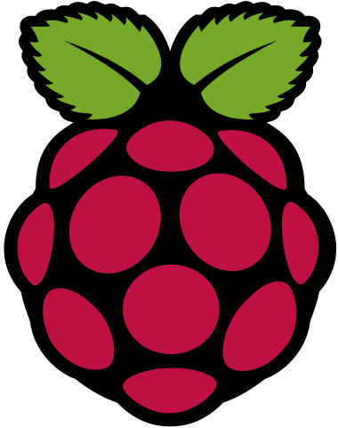

class: split-30 nopadding
background-image: url( https://cloud.githubusercontent.com/assets/4231611/13377561/082b6174-de13-11e5-8754-e645fbb3aa71.jpg )

.column_t2.center[.vmiddle[
.fgtransparent[
.figplaint[

]
]
]]
.column_t2[.vmiddle.nopadding[
.shadelightdark[.boxtitle1[
### LTKA Labs
# SBCs &amp; Raspberry Pi Basics

### [Eueung Mulyana](https://github.com/eueung)
### http://eueung.github.io/ET3010/raspi
#### ET-3010 | [Attribution-ShareAlike CC BY-SA](https://creativecommons.org/licenses/by-sa/4.0/)
#### 
]]
]]

---
class: column_t1 middle

.fonth4[
.tab1.fullwidth[
| Outline  |
|:-------------:|
| Single Board Computers |
| Raspberry Pi - Short Introduction |
| RPi Pinout |
| Raspbian - Getting Started |
| Node-RED &amp; Python |
]]

---
class: split-30 nopadding
background-image: url( https://cloud.githubusercontent.com/assets/4231611/13377561/082b6174-de13-11e5-8754-e645fbb3aa71.jpg )

.column_t2.center[.vmiddle[
.fgtransparent[
.figplaint[

]
]
]]
.column_t2[.vmiddle.nopadding[
.shadelightdark[.boxtitle1[
### SBCs
# Single Board Computers

### 
### 
#### 
#### 
]]
]]

---
class: split-50 nopadding 

.column_t1[.vmiddle[


.bluelight[A Single-Board Computer (SBC) is a computer built on a single circuit board, with microprocessor(s), memory, input/output (I/O) and other features required of a functional computer.] SBCs typically provide a fanless, low-power computing solution. .bluelight[Current SBCs come with a wide variety of processor types, most with GPUs on-board.] These processors range from X86 based processors from the .uline[traditional] PC space (AMD and Intel) to **ARM** processors which have traditionally been used in the industrial and more recently .uline[mobile] spaces. The most prevalent form of software used on SBCs is **Linux** with numerous derivations including Android, Ubuntu, Fedora, Debian and Arch Linux as well as FreeBSD.

.bluelight[Many of today's SBCs have become so powerful that they are beginning to have the capability of modern day PCs and tablets.] This trend will continue as more powerful processors make their way into the embedded computing market as ever-increasing performance/price ratios rise, as well as additional manufacturers enter into this "Wild West" frontier of supporting **open source** hardware and software for both .uline[DIYers] and .uline[professionals] alike.


]]
.column_t2[.vmiddle[

# SBCs

In .red[2006], a group based in the University of Cambridge's Computer Laboratory, decided to address the need for a low cost computing platform that would allow kids to learn how to program without the need for a full-fledged home computer. 

The result was a .red[**$35**] single board computer named **Raspberry Pi**. While initially designed as a tool for students to learn programming, the Raspberry Pi was adopted by .uline[makers], .uline[designers], .uline[students] and even .uline[professional engineers] and helped to launch the current boom in interest in SBCs.

Ref: Electronic Design, **Then and Now A Brief History of Single Board Computers**


]]

---
class: split-70 nopadding 
background-image: url(images/fig01.jpg)

.column_t2[.vmiddle[
]]
.column_bt[.vmiddle.pushfront.right[

.fonth5[Nine Sub-$50 SBCs that Challenge the **Raspberry Pi** and **BeagleBone Black**]

86Duino, A10-OLinuXino-Lime, Arduino TRE, Banana Pi, BPi D1, HummingBoard-i1, Odroid-C1, Orange Pi, and pcDuino3 Nano

Ref: [hackerboards.com](http://hackerboards.com/ringing-in-2015-with-40-linux-friendly-hacker-sbcs/)
]]

---
class: split-30 nopadding 
background-image: url(images/fig02.jpg)

.column_bt[.vmiddle.pushfront.right[

.fonth5[Top 10 Sub-$100 Hacker SBC List for 2015 (in Order of Importance)]

Ref: [hackerboards.com](http://hackerboards.com/top-ten-sub-100-dollar-hacker-sbcs-for-your-holiday-pleasure/)

]]
.column_t2[.vmiddle[
]]

---
class: center 
background-image: url(images/fig03.jpg)

####&nbsp;
# 64-bit SBCs: **DragonBoard** 410c &amp; **Pine** A64

---
class: split-30 nopadding
background-image: url( https://cloud.githubusercontent.com/assets/4231611/13377561/082b6174-de13-11e5-8754-e645fbb3aa71.jpg )

.column_t2.center[.vmiddle[
.fgtransparent[
.figplaint[

]
]
]]
.column_t2[.vmiddle.nopadding[
.shadelightdark[.boxtitle1[
### Raspberry Pi / RPi / RasPi
# Short Introduction

### 
### 
#### 
#### 
]]
]]

---
class: column_t1 middle center

##What is a Raspberry Pi?
<br/>
.fonth5[
The **Raspberry Pi** is a low cost, .yellow[**credit-card sized computer**] that plugs into a computer monitor or TV, and uses a standard keyboard and mouse. It is a capable little device that enables people of all ages to .uline[explore computing], and to learn how to program in languages like Scratch and Python. It's .yellow[capable of doing everything you'd expect a desktop computer to do], from browsing the internet and playing high-definition video, to making spreadsheets, word-processing, and playing games.
]

<br/>
What's more, the Raspberry Pi  has the ability to **interact** with the .uline[outside world], and has been used in a wide array of digital maker projects, from .uline[music machines] and .uline[parent detectors] to .uline[weather stations] and .uline[tweeting birdhouses with infra-red cameras]. 

---
class: split-30 nopadding 
background-image: url(images/fig04.jpg)

.column_bt[.vmiddle.pushfront.right[

Credit card sized single board computer <br/><br/>
Teach computer science in schools at an affordable price: Grade School, Middle School & High School<br/><br/>
Design and Development started in 2006<br/><br/>
Raspberry PI Foundation founded in 2009<br/><br/>
Release to Market Feb 2012<br/><br/>
3 Million sold by June 2014<br/>5 Million by 03/2015

]]
.column_t2[.vmiddle[
]]

---
class: split-70 nopadding 
background-image: url(images/fig05.jpg)

.column_t2[.vmiddle[
]]
.column_bt[.vmiddle.pushfront[
### Early Models A, B
Raspberry PI Model A $25 - 256 MB RAM, 1 USB, No Ethernet, GPIO 26<br/><br/>
Raspberry PI Model B $35 - 512 MB RAM, 2 USB, Ethernet , GPIO 26<br/><br/>
Raspberry PI Model B+ $35 - 512 MB RAM, 4 USB, Ethernet, GPIO 40<br/><br/>
All have HDMI Out with Audio<br/><br/>
All have Audio Jack out
]]

---
background-image: url(images/fig06.jpg)

---
background-image: url(images/fig07.jpg)
class: split-50 nopadding 

.column_t1[.vmiddle[


##Model A/.yellow[**B**]:
- Broadcom **BCM2835** (CPU & GPU)
- 256/512MB SDRAM
- 1/2 USB 2.0 Ports
- None/Ethernet Port
- HDMI
- Audio
- SD Card Slot
- Micro USB for power


]]
.column_t2[.vmiddle[


]]

---
class: split-30 nopadding 
background-image: url(images/fig08.jpg)

.column_bt[.vmiddle.pushfront.right[
### RPi Model B
# Power
]]
.column_t2[.vmiddle[
]]

---
class: split-30 nopadding 
background-image: url(images/fig09.jpg)

.column_bt[.vmiddle.pushfront.right[
### RPi Model B
# Audio &amp; Video
]]
.column_t2[.vmiddle[
]]

---
class: split-30 nopadding 
background-image: url(images/fig10.jpg)

.column_bt[.vmiddle.pushfront.right[
### RPi Model B
# Connectivity
]]
.column_t2[.vmiddle[
]]

---
class: split-30 nopadding 
background-image: url(images/fig11.jpg)

.column_bt[.vmiddle.pushfront.right[
### RPi Model B
# Internals
]]
.column_t2[.vmiddle[
]]

---
class: split-30 nopadding 
background-image: url(images/fig12.jpg)

.column_bt[.vmiddle.pushfront.right[
### RPi Model B
# Storage
]]
.column_t2[.vmiddle[
]]

---
class: split-30 nopadding 
background-image: url(images/fig13.jpg)

.column_bt[.vmiddle.pushfront.right[
### RPi Model B
# Parts
]]
.column_t2[.vmiddle[
]]

---
class: split-50 nopadding 
background-image: url(images/fig14.jpg)

.column_t1[.vmiddle.pushfront[
###CPU Overview
#BCM2835
- ARM11J6JZF-S (ARM11 Family)
- **ARMv6** Architecture
- **Single Core**
- **32-Bit** RISC
- 700 MHz Clock Rate
- 8 Pipeline Stages
- Branch Prediction

]]
.column_t2[.vmiddle[
]]

---
background-image: url(images/fig15.jpg)

---
class: split-30 nopadding 
background-image: url(images/fig16.jpg)

.column_t1[.vmiddle.pushfront[
#RPi 2B
- BCM 2836
- **ARMv7** Architecture
- **Quad Core**
- **32-Bit** RISC
- 900 MHz Clock Rate
- 1 GB RAM

]]
.column_t2[.vmiddle[
]]

---
background-image: url(images/fig17.jpg)

---
background-image: url(images/fig18.jpg)

---
background-image: url(images/fig19.jpg)

---
class: split-30 nopadding 
background-image: url(images/fig20.jpg)

.column_t1[.vmiddle.pushfront[
#RPi 3B
- BCM 2837
- **ARMv8** Architecture
- **Quad Core**
- **64-Bit** 
- 1.2 GHz Clock Rate
- 1 GB RAM

]]
.column_t2[.vmiddle[
]]

---
background-image: url(images/fig21.jpg)

---
background-image: url(images/fig21b.jpg)

---
background-image: url(images/fig22.jpg)

---
background-image: url(images/fig23.jpg)

---
background-image: url(images/fig24.jpg)

---
class: split-30 nopadding
background-image: url( https://cloud.githubusercontent.com/assets/4231611/13377561/082b6174-de13-11e5-8754-e645fbb3aa71.jpg )

.column_t2.center[.vmiddle[
.fgtransparent[
.figplaint[

]
]
]]
.column_t2[.vmiddle.nopadding[
.shadelightdark[.boxtitle1[
### 
# RPi Pinout

### 
### 
#### 
#### 
]]
]]

---
background-image: url(images/fig25.jpg)

---
background-image: url(images/fig26.jpg)

---
background-image: url(images/fig27.jpg)

---
class: split-50 nopadding 
background-image: url(images/fig28.jpg)

.column_t1[.vmiddle.pushfront.right[
### Interactive Pinout Diagram
#https://pinout.xyz

]]
.column_t2[.vmiddle[
]]

---
class: split-50 nopadding 

.column_t1[.vmiddle.pushfront.right[
#Notes
####&nbsp;

On Raspberry Pi, all GPIO banks are supplied from .yellow[**3.3V**].
.bluelight[**Connection of a GPIO to a voltage .uline[higher than 3.3V] will likely .uline[destroy] the GPIO block within the SoC**].

]]
.column_t2[.vmiddle[
.fonth5[
- The Raspberry Pi is a **3.3V** device
- The GPIO pins are .uline[unbuffered] and .uline[unprotected], so if you short something out, you could fry your whole Pi, so be careful!
]
]]

---
class: split-50 nopadding 
background-image: url(images/fig29.jpg)

.column_t1[.vmiddle.pushfront.right[
### Physical Computing
# RPi vs. Arduino
<br/>
Arduino boards are micro-controllers, not full computers. They .uline[don't run] a **full** operating system, but simply execute written code as their firmware interprets it.
<br/><br/>
You lose access to the basic tools an operating system provides, but on the other hand, directly executing simple code is .uline[easier], and is accomplished with **no** operating system .uline[overhead].
<br/><br/>
The main purpose of the Arduino board is to .uline[interface] with sensors and devices, so it's great for hardware projects in which you simply want things to respond to various sensor readings and manual input.
<br/><br/>
Ref: Digital Trends via Kopcak
]]
.column_t2[.vmiddle[
]]

---
class: split-30 nopadding
background-image: url( https://cloud.githubusercontent.com/assets/4231611/13377561/082b6174-de13-11e5-8754-e645fbb3aa71.jpg )

.column_t2.center[.vmiddle[
.fgtransparent[
.figplaint[

]
]
]]
.column_t2[.vmiddle.nopadding[
.shadelightdark[.boxtitle1[
### Raspbian
# Getting Started

### 
### 
#### 
#### 
]]
]]

---
class: split-70 nopadding 
background-image: url(images/fig30.jpg)

.column_t2[.vmiddle[
]]
.column_bt[.vmiddle.pushfront[

# RPi
###Operating Systems
<hr/>
Ref: [Software for the RPi](https://www.raspberrypi.org/downloads/)
<br/><br/><br/><br/><br/>
<br/><br/><br/><br/><br/><br/><br/>
]]

---
class: split-70 nopadding 
background-image: url(images/fig31.jpg)

.column_t2[.vmiddle[
]]
.column_bt[.vmiddle.pushfront[
## Raspbian Jessie
#### Release 2016-03-18
<hr/>
.fonth5[Full Desktop vs. Lite]
<br/><br/><br/><br/><br/>
<br/><br/><br/><br/><br/><br/><br/>
]]

---
class: split-50 nopadding 

.column_t1[.vmiddle.pushfront.right[
# General Steps

It is always recommended to connect the MicroUSB Power to the unit .yellow[**last**] (while most connections can be made live, it is best practice to connect items such as displays and other connections with the power turned **off**).

Ref: [Basic Setup](http://elinux.org/RPi_Hardware_Basic_Setup#Connecting_Together)
]]
.column_t2[.vmiddle[
1. Plug the **SD Card** loaded with the Operating System into the Raspberry Pi.
1. If required, plug the **USB keyboard** and mouse into the Raspberry Pi, perhaps via a USB Hub. Connect the Hub to power, if necessary.
1. If required, plug the video cable into **the display** and into the Raspberry Pi.
1. Plug in your **Network** cable, or Wi-Fi dongle, if required.
1. Ensure that your USB Hub (if any) and display are working.
1. With your screen on, plug the other end of the **power source** into the Raspberry Pi.
1. Plug the power source into the main socket, and **switch it on**.
1. If connected to a display, the Raspberry Pi should boot up and display messages on the screen.
1. If running .uline[headless], it should boot up. When the leds have stopped flashing, connect to the Raspberry Pi from the remote computer. Whether this works will depend on the operating system you are using; the Raspian Linux operating system is configured to allow SSH connections by default.
]]

---
class: split-70 nopadding 
background-image: url(images/fig32.jpg)

.column_t2[.vmiddle[
]]
.column_bt[.vmiddle.pushfront[
## Flashing SD Card
<hr/>
[Rufus](https://rufus.akeo.ie/)
<br/><br/><br/><br/><br/>
<br/><br/><br/><br/><br/><br/><br/>
<br/><br/><br/><br/><br/>
<br/><br/><br/>
]]

---
background-image: url(images/fig37.jpg)

---
class: split-50 nopadding 
background-image: url(images/fig33.jpg)

.column_t1[.vmiddle.pushfront.right[
# SSH via PuTTY
]]
.column_t2[.vmiddle[
]]

---
class: split-70 nopadding 
background-image: url(images/fig34.jpg)

.column_t2[.vmiddle[
]]
.column_bt[.vmiddle.pushfront[
## SSH Console
<hr/>
## raspi-config
]]


---
class: split-50 nopadding 

.column_t1[.vmiddle.pushfront.right[
# Some CLIs
]]
.column_t2[.vmiddle[
## Remote SSH Session

```bash
*# credential: pi/raspberry
$ sudo raspi-config

*# after reboot
*$ df -h

$ uname -a
$ lsb_release -a
```

## TightVNC Server

```bash
$ sudo apt-get install tightvncserver

*$ tightvncserver 
*# access password, min 6 chars

$ vncserver :1 -geometry 800x600 -depth 24
$ sudo service lightdm stop
```

]]

---
class: split-50 nopadding 
background-image: url(images/fig35.jpg)

.column_t2[.vmiddle[
]]
.column_bt[.vmiddle.pushfront[
# VNC Client
]]

---
background-image: url(images/fig36.jpg)

---
class: split-30 nopadding
background-image: url( https://cloud.githubusercontent.com/assets/4231611/13377561/082b6174-de13-11e5-8754-e645fbb3aa71.jpg )

.column_t2.center[.vmiddle[
.fgtransparent[
.figplaint[

]
]
]]
.column_t2[.vmiddle.nopadding[
.shadelightdark[.boxtitle1[
### 
# Node-RED &amp; Python

### 
### 
#### 
#### 
]]
]]

---
class: split-50 nopadding 

.column_t2[.vmiddle.right[

Node-RED is a tool for wiring together .uline[hardware devices], .uline[APIs] and .uline[online services] in new and interesting ways.

Node-RED provides a browser-based flow editor that makes it easy to wire together **flows** using the wide range **nodes** in the palette. Flows can be then deployed to the runtime in a single-click.

JavaScript functions can be created within the editor using a rich text editor.

A built-in library allows you to save useful functions, templates or flows for re-use.

Ref: [Node-RED](http://nodered.org/)
]]
.column_t1[.vmiddle.pushfront.center[
# Node-RED
####A visual tool for wiring the .yellow[**Internet of Things**]

.figplaint[

]

]]

---
background-image: url(images/fig42.jpg)

---
background-image: url(images/fig38.jpg)

---
background-image: url(images/fig39.jpg)

---
background-image: url(images/fig40.jpg)

---
class: split-70 nopadding 
background-image: url(images/fig41.jpg)

.column_t2[.vmiddle[
]]
.column_bt[.vmiddle.pushfront[
# Python
#### via IDLE

```python
*import RPi.GPIO as GPIO
import time

*GPIO.setmode(GPIO.BCM)
GPIO.setwarnings(False)

led = 4
*GPIO.setup(led,GPIO.OUT)

*def blink(pin):
* GPIO.output(pin,1)
* time.sleep(1)
* GPIO.output(pin,0)
* time.sleep(1)

for i in range (0,10):
  blink(led)
  
GPIO.cleanup()
```
]]

---
class: split-30 nopadding
background-image: url( https://cloud.githubusercontent.com/assets/4231611/13377561/082b6174-de13-11e5-8754-e645fbb3aa71.jpg )

.column_t2.center[.vmiddle[
.fgtransparent[
.figplaint[

]
]
]]
.column_t2[.vmiddle.nopadding[
.shadelightdark[.boxtitle1[
### 
# Refs

### 
### 
#### 
#### 
]]
]]

---
# Refs
.fonth5[
1. [Top ten sub-$100 hacker SBCs for your holiday pleasure](http://hackerboards.com/top-ten-sub-100-dollar-hacker-sbcs-for-your-holiday-pleasure/)
1. [Ringing in 2015 with 40 Linux-friendly hacker SBCs](http://hackerboards.com/ringing-in-2015-with-40-linux-friendly-hacker-sbcs/)
1. Cliff Ortmeyer, Then and Now A Brief History of Single Board Computers, Electronic Design, Issue 6, December 2014
1. [RPi Low-level peripherals - eLinux.org](http://elinux.org/RPi_Low-level_peripherals)
1. [Introducing the Raspberry Pi 3 | Hackaday](https://hackaday.com/2016/02/28/introducing-the-raspberry-pi-3/comment-page-2/)
1. [Adafruit Learning System](https://learn.adafruit.com/category/learn-raspberry-pi)
1. Jeffrey Kopcak, An Introduction to the Credit-Card Sized Computer
1. [The MagPi Magazine - The official Raspberry Pi magazineThe MagPi Magazine](https://www.raspberrypi.org/magpi/) 
1. Mike Linnen, What can I do with a Raspberry Pi
1. Jon Holton and Tim Fratangelo, Raspberry Pi Architecture

]

---
class: split-30 nopadding
background-image: url( https://cloud.githubusercontent.com/assets/4231611/13377561/082b6174-de13-11e5-8754-e645fbb3aa71.jpg )

.column_t2.center[.vmiddle[
.fgtransparent[
.figplaint[

]
]
]]
.column_t2[.vmiddle.nopadding[
.shadelightdark[.boxtitle1[
### 
# END

### [Eueung Mulyana](https://github.com/eueung)
### http://eueung.github.io/ET3010/raspi
#### LTKA Labs | [Attribution-ShareAlike CC BY-SA](https://creativecommons.org/licenses/by-sa/4.0/)
#### 
]]
]]


